## Deutsch Algorithm

### Introduction


This python program provided as an example by Google Cirq implements the Deutsch quantum algorithm.

You can refer to this article [The Deutsch-Jozsa algorithm](https://einsteinrelativelyeasy.com/index.php/quantum-mechanics/168-the-deutsch-jozsa-algorithm) on my website [einsteinrelativelyeasy.com](https://einsteinrelativelyeasy.com/) to read a quick introduction to this algorithm.

During this article, we will particularly break down how the different quantum oracles are implemented.

### Getting Started

You have several options:

 1. The simplest way of executing the algorithm is to execute the Python Jupyter notebook remotely on a machine by clicking the icon [](https://mybinder.org/v2/gh/cyrilondon/quantum-mechanics-python/master)
 
 Wait until the server is properly launched (after 46 steps - it should take no more than one minute)
 
  - double-click the `deutsch/Deutsch_algorithm.ipynb` notebook
  
  - execute `Cell -> Run All`
  
    It will takes a little time until all the packages have been installed
    
```python
Successfully installed cachetools-4.1.0 cirq-0.8.0 cycler-0.10.0 freezegun-0.3.15 google-api-core-1.17.0 google-auth-1.14.2 googleapis-common-protos-1.51.0 
grpcio-1.28.1 kiwisolver-1.2.0 matplotlib-3.2.1 mpmath-1.1.0 networkx-2.4 numpy-1.18.4 pandas-1.0.3 protobuf-3.8.0
 pyasn1-0.4.8 pyasn1-modules-0.2.8 pyparsing-2.4.7 pytz-2020.1 rsa-4.0 scipy-1.4.1 sortedcontainers-2.1.0 sympy-1.5.1 typing-extensions-3.7.4.2
 ```
 
 but then you should see the result at the bottom of the jupyter sheet, like this one
 
 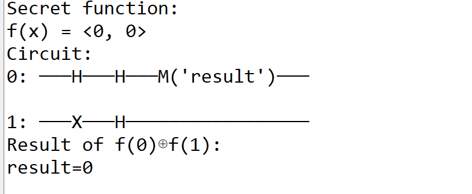
 
 Congratulations, you have run the Deutsch quantum algorithm! In only one measurement, you were able to qualify the function f(x)=0 as constant!
 
 To re-run it, just place yourself in the main bottom cell
 
 ```python
 if __name__ == '__main__':
    main()
  ```
 
 and execute it by clicking the small arrow on the left side.
 
 
   
 2. If you have Python installed on your local computer
      
     - clone the project
 
     - install Cirq via 
    
```python   
python -m pip install --upgrade pip
python -m pip install cirq
```

Execute [deutsch.py](deutsch.py) or even better if you have a Jupiter notebook environment installed locally, run [Deutsch_algorithm.ipynb](Deutsch_algorithm.ipynb) locally on your favourite browser.

Enjoy!

## Program

The quantum circuit implementing the Deutsch algorithm is shown below

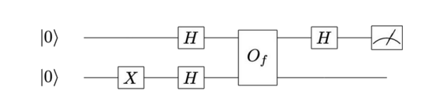

In a few words, we bring two qubits in a superposition state via a Hadamard gate, we then apply a `quantum oracle` O(f) to this 2-qubit state and we finally make a measurement of the first qubit.

These main three steps are defined in the function  `make_deutsch_circuit`

```python 
def make_deutsch_circuit(q0, q1, oracle):
    c = cirq.Circuit()

    # Initialize qubits.
    c.append([X(q1), H(q1), H(q0)])

    # Query oracle.
    c.append(oracle)

    # Measure in X basis.
    c.append([H(q0), measure(q0, key='result')])
    return c
```

This (unique) measure will be enough to determine the nature of the function, at least if she is `constant` or `balanced`.

### Quantum Oracle

The most interesting of the program concerns the second step of the algorithm, i.e. the `quantum oracle`.

An oracle is a quantum operation represented by a unitary matrix O that transforms its input state as

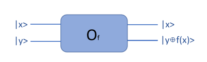

The oracle maps the state |x>|y> to |x>|y XOR f(x)> , where XOR is addition modulo 2.
In other words, the oracle leaves the |x> qubit in its original state, and the |y> qubit is replaced by the XOR operation between y and f(x).

We knwo that the final state in which we should be just before the final measurement of the first qubit is

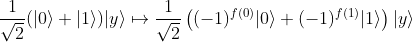

which could be broken down in the four following cases

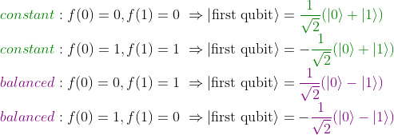

Finally, below is the code responsible for generating a quantum Oracle based on the randomly generated function

```python 

# Pick a secret 2-bit function and create a circuit to query the oracle.
  secret_function = [random.randint(0, 1) for _ in range(2)]
  oracle = make_oracle(q0, q1, secret_function)
    
def make_oracle(q0, q1, secret_function):
    """ Gates implementing the secret function f(x)."""

    if secret_function[0]:
        yield [CNOT(q0, q1), X(q1)]

    if secret_function[1]:
        yield CNOT(q0, q1)
```

Our aim here will be to double-check that in each case, applying the quantum Oracle leads to the correct output state for the first qubit and thus to the expected measurement.

#### f(x) = 0

Let us first consider the case where `f(x)= 0`.

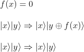

The output |x>|y XOR f(x)> equates |x>|y XOR 0> that equates the input |x>|y>, which means basically that the Oracle in this case should do NOTHING to its input state.


we verify that with f(0)=0 and f(1)=0 then secret_function[0] = 0 and secret_function[1] = 0 so that the function `make_oracle` returns without giving any oracle.

Thus the quantum circuit in the case of f(x) = 0 simply  looks like


We also easily verify that measurement of the first qubit gives 0.

As the Hadamard gate is a quantum gate, it is by definition `reversible` therefore applying twice a Hadamard gate to the qubit |0> gives back |0> which gives 0 when measured.

If you need to be convinced of the above statement, here is the proof:

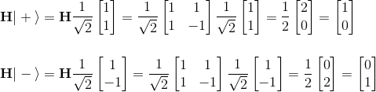


#### f(x) = x (ID)

The second case for which the quantum Oracle can be easily deduced is for f(x)=x (identity function)

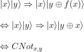

If f(0)=0 and f(1)=1 the function `make_oracle` returns indeed the CNOT gate, resulting in the following quantum circuit

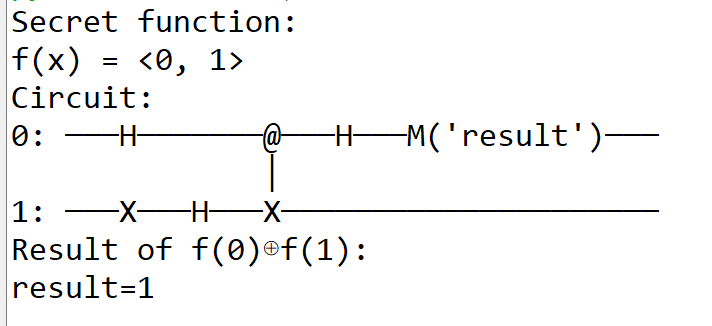

Applying the CNOT gate to the input (2 qubits in superposition state H|0>H|1>) gives

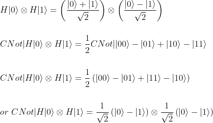

If you are more into matrix representation, you may rather follow this path as well

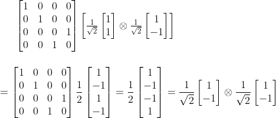

We are all good for the state of the first qubit before applying the Hadamard gate and measurement (refer to the above table mapping the function to the first qubit state just after the Oracle gate).
We are now ready to verify that applying the Hadamard gate to the first qubit state leads as expected to a measure of 1:


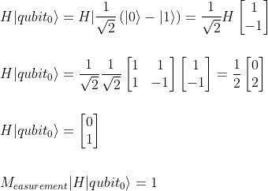

which is the expected value.

#### f(x) = NOT x

Considering now the case of f(0)=1 and f(1)=0 (f is balanced), we know that we should measure 1 as final measurement.

Let us double-check this.

The `make_oracle` routine only goes through the first if statement and therefore returns CNOT(q0, q1), X(q1) quantum gates.


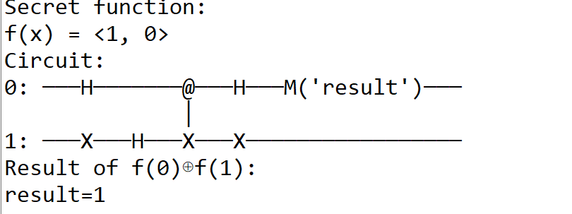

Compared to the previous quantum circuit, we just have to apply an extra Pauli-X gate to the second qubit, which yields to:

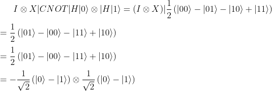

The state of the first qubit is -1/sqrt2(|0> - |1), leading to a 1 measurement.

#### f(x) = 1 

Finally, we have to consider the fourth case of the constant function f(x) = 1.

In this particular case, the `make_oracle` routine goes through the two if statements, leading to the following quantum circuit

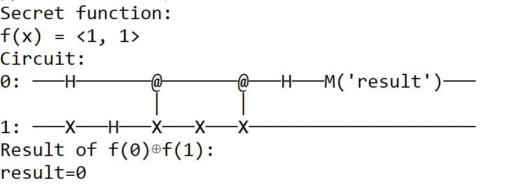

Compared to the previous quantum circuit, we just have to apply an extra CNOT gate to the two qubit states leading to:

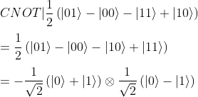

The state of the first qubit is -1/sqrt2(|0> + |1), therefore we get 0 when measure it.

CQFD.


